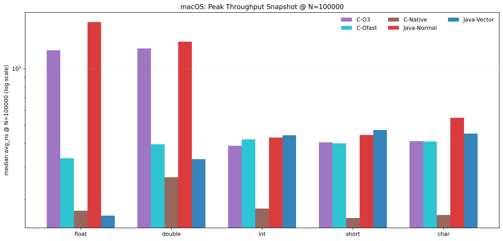
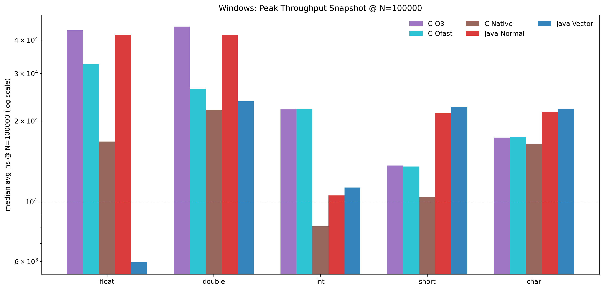
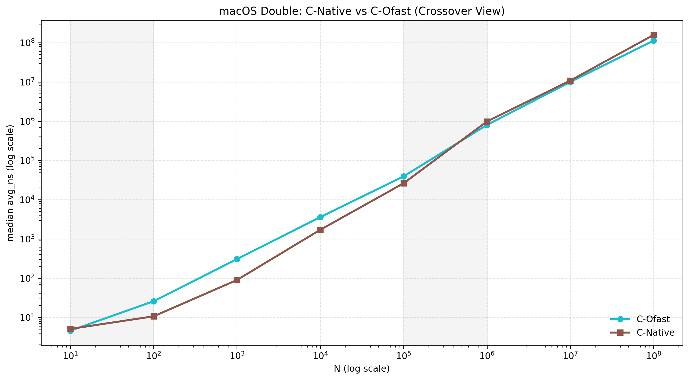

# Project 2 Report（精修展示版）

**作者**：邵浩林  
**学号**：12413323  
**日期**：2026-04-11

---

## Abstract

本报告比较了 `C` 与 `Java` 在向量点乘任务上的性能，并重点分析：

- C 编译选项：`-O0/-O1/-O2/-O3/-Ofast/-Ofast -march=native`
- Java 路径：常规实现 vs `Vector API`（`jdk.incubator.vector`）
- 跨平台差异：macOS 与 Windows

结论上，`-Ofast` 与 `-march=native` 的确能把 C 推到更高性能上限；`Java Vector API` 在浮点类型上带来明显收益，但在小位宽整数类型不一定占优。性能优化呈现“规模依赖”特征，而非单一开关的全局收益。

---

## 1. 实验设置

### 1.1 任务与数据

- 任务：向量点乘
- 数据类型：`signed_char`、`short`、`int`、`float`、`double`
- 向量长度：$N \in \{10,10^2,10^3,10^4,10^5,10^6,10^7,10^8\}$

### 1.2 输出格式

统一 CSV 字段：

```text
lang,type,N,reps,total_ns,avg_ns,checksum
```

其中 `checksum` 用于结果正确性对齐校验。

---

## 2. 环境概览

- **macOS**：i5-1038NG7 / Clang 14 / JDK 17
- **Windows**：i7-13650HX / GCC 15.1 / JDK 24

> 跨平台绝对性能差异受“硬件代差 + 工具链版本”共同影响，不能仅归因于操作系统。

---

## 3. 关键图表（展示版）

## 3.1 图表 1：极致算力大阅兵（柱状图）

设定 $N=100000$（缓存内高算力场景），对比系列：

- `C-O3`
- `C-Ofast`
- `C-Native`
- `Java-Normal`
- `Java-Vector`

### macOS



### Windows



**读图建议**：先横向比较同一类型下 5 个系列，再纵向比较同一系列在不同类型上的波动。

## 3.2 图表 2：规模演化与 crossover（折线图）

场景：macOS、`double`、`C-Ofast` vs `C-Native`。



关键点：

- $N=10^5$：`C-Native` 更快（`26355 ns` vs `39515 ns`）
- $N=10^6$：发生反转，`C-Ofast` 更快（`808150 ns` vs `990100 ns`）

这体现出：激进指令集收益依赖数据规模，受缓存与带宽边界约束。

---

## 4. 正确性与一致性

针对 `-O3`、`-Ofast`、`-Ofast -march=native` 的 `checksum` 对齐结果：

- `TOTAL=40`
- `DIFF=0`

即三种 C 编译路径在本实验输入上得到一致结果。

---

## 5. 结论

1. **C 的上限更高**：在激进优化下，C 可充分释放 SIMD 潜力。  
2. **Java 已具竞争力**：常规 Java 在多数场景表现稳定，Vector API 在浮点上收益显著。  
3. **优化要看规模**：`-march=native` 并非“全域最优”，存在 crossover。  
4. **平台差异要解耦**：硬件代差和工具链升级是跨平台差异的关键解释变量。

---

## 6. 复现命令（简）

```zsh
cd /Users/manfred/Documents/CPP/projects
./run_dotproduct_c.sh 5
./run_dotproduct_java.sh 5
./run_dotproduct_java_vector.sh 5
/Users/manfred/Documents/CPP/.venv/bin/python plot_showcase_charts.py
```

Windows 侧对应脚本：

- `windows/run_dotproduct_c_native.ps1`
- `windows/run_dotproduct_java_vector.ps1`
- `windows/run_native_vector.ps1`

---

## 7. 文稿说明

- 原始全量版本：`../report.md`
- 精修展示版本：`./report_executive.md`
- typo/格式问题清单：`./TYPO_FIXES.md`
