# Project 2 Report

## 1. 实验目标与范围

本实验的目标是比较 C 与 Java 在不同数据类型和向量长度下的点乘性能，并分析编译优化级别对 C 版本的影响。我们关注以下维度：

- 语言：`C` 与 `Java`
- 数据类型：`signed_char`、`short`、`int`、`float`、`double`
- 向量长度：`N = {1e1, 1e2, 1e3, 1e4, 1e5, 1e6, 1e7, 1e8}`
- C 编译优化级：`-O0`、`-O1`、`-O2`、`-O3`

输出统一为 CSV，核心字段为：

`lang,type,N,reps,total_ns,avg_ns,checksum`

---
## 2.实验前的预期
1. **运行时间随着 N 增大基本线性增长**：
   点乘是典型 O(N) 顺序访问。N 增大时：
- 计算次数线性增加
- 数据工作集逐渐超出 L1/L2 cache
- 延迟更多转为内存带宽主导

   因此 `avg_ns` 大体随 `N` 线性增长。
1. **运行时间随着数据类型位宽增加而增长**：更宽的数据类型（如 double）通常需要更多的计算资源和内存带宽，预期 avg_ns 随数据类型位宽增加而增长。
2. **性能随优化级提升**：预计随着编译优化级别的提高，C 版本的性能将得到显著改善。
3. **异常快/0ns/离散点**：可能由于计时分辨率限制、优化级触发不同循环变换、系统噪声等原因导致某些点出现异常快或离散的结果。
4. **C 与 Java 性能对比预期**：预计 C 版本在大多数情况下会比 Java 版本更快，特别是在开启-O3 优化级时。
---

## 3. 实验环境
### 3.1 macOS实验环境
#### 3.1.1 操作系统与内核

- OS：`macOS 12.7.4`
- 内核：`Darwin 21.6.0`（`x86_64`）

#### 3.1.2 硬件环境

- CPU 型号：`Intel(R) Core(TM) i5-1038NG7 CPU @ 2.00GHz`
- 物理核心：`4`
- 逻辑核心：`8`
- 内存：`17179869184` bytes（约 `16 GiB`）

#### 3.1.3 C 运行环境（编译/链接）

- `cc --version`：Apple clang `14.0.0 (clang-1400.0.29.202)`
- `clang --version`：Apple clang `14.0.0 (clang-1400.0.29.202)`
- Target：`x86_64-apple-darwin21.6.0`
- Thread model：`posix`

#### 3.1.4 Java 运行环境（JVM/JDK）

- `java -version`：
   - `openjdk version "17.0.17" 2025-10-21`
   - `OpenJDK Runtime Environment (build 17.0.17+10)`
   - `OpenJDK 64-Bit Server VM (build 17.0.17+10, mixed mode, sharing)`
- `javac -version`：`javac 17.0.17`

### 3.2 Windows 实验环境

#### 3.2.1 操作系统

- OS：`Microsoft Windows 11 家庭中文版`
- 版本：`10.0.26100`（Build `26100`）
- 架构：`64 位`

#### 3.2.2 硬件环境

- CPU 型号：`13th Gen Intel(R) Core(TM) i7-13650HX`
- 物理核心：`14`
- 逻辑核心：`20`
- 内存：`16780582912` bytes（约 `15.63 GiB`）

#### 3.2.3 C 运行环境（编译/链接）

- `gcc --version`：`gcc.exe (MinGW-W64 x86_64-ucrt-posix-seh, built by Brecht Sanders, r2) 15.1.0`

#### 3.2.4 Java 运行环境（JVM/JDK）

- `java -version`：
   - `java version "24.0.1" 2025-04-15`
   - `Java(TM) SE Runtime Environment (build 24.0.1+9-30)`
   - `Java HotSpot(TM) 64-Bit Server VM (build 24.0.1+9-30, mixed mode, sharing)`
- `javac -version`：`javac 24.0.1`

---
## 4. 软件程序
### 4.1 C 版本：`dotproduct.c`

关键实现点：

1. 使用 `xorshift64` 按固定 seed 生成输入数据，保证可复现。
2. 对 5 种类型分别实现点乘函数：
   - `dot_schar_once`
   - `dot_short_once`
   - `dot_int_once`
   - `dot_float_once`
   - `dot_double_once`
3. `reps_for_n(n)` 根据 `N` 自动设定重复次数，目标约 `20M` 次乘加，范围 `[3, 2_000_000]`。
4. 计时使用 `clock_gettime(CLOCK_MONOTONIC)`（纳秒级，单调时钟）。
5. 使用 `volatile` 全局 `checksum` 防止计算被优化掉。
6. - `asm volatile("" ::: "memory")`（编译器屏障）意思是内存可能随时被外界改写，告诉编译器每一次循环都要重新读取，目的是减少“循环被过度优化”带来的假快现象。（具体参见7.1节）
7.   - `__attribute__((noinline))`（禁止内联）用于防止函数被内联展开，保持测试的独立性和稳定性。但是我在后续实验中发现一个违背直觉的现象，去掉 `noinline` 后程序更慢了——也就是说，允许dot_once内联后程序性能反而变差了（结果见下图）。我的分析如下：
   ```
   // 去掉 noinline 后，编译器眼中的代码变成了这样：
   for (int r = 0; r < reps; r++) {
    // ---- 点乘函数被强制内联塞进来了 ----
    for (size_t i = 0; i < n; i++) {
        acc += (double)a[i] * (double)b[i];
    }
    // ------------------------------------
    
    // 紧接着就是内存屏障！
    __asm__ volatile("" : : : "memory"); 
   }
   ```
   - 编译器在分析上面这坨代码时，看到了那个可怕的 memory 屏障。它会吓得瑟瑟发抖：“天呐！刚刚做完一次点乘循环，内存就可能被未知力量修改！那我不仅不敢把这段代码提到外面，我连内层 for 循环里的变量 a、b 和 acc 都不敢放在 CPU 高速寄存器里了！”结果就是：外层的内存屏障“污染”了内层的高性能计算，导致内层循环也失去了最高级别的优化。

   <figure>
   
   <figcaption>左边是允许单次点乘内联，右边是禁止。不难发现右边平均用时更少</figcaption>
   </figure>

8.   
     - 在分析内联的时候，我使用-Rpass-analysis=loop-vectorize来观察编译器对哪些循环进行了向量化处理，有用的结果如下：
   ```
   dotproduct.c:137:13: remark: loop not vectorized: cannot prove it is safe to reorder floating-point operations; allow reordering by specifying '#pragma clang loop vectorize(enable)' before the loop or by providing the compiler option '-ffast-math'. [-Rpass-analysis=loop-vectorize]
        acc += (double)a[i] * (double)b[i];
   ```
   - 大意是说浮点数点乘 dot_float / dot_double (Line 137, 145) 没有被向量化的原因是：在数学中，加法满足结合律，但在计算机的浮点数（IEEE 754 标准）中，由于精度截断的原因，浮点数的加法是不满足结合律的。如果要使用 SIMD（向量化）来加速点乘，编译器必须把数组分成几部分并行相加，最后再合并。这会改变浮点数相加的顺序，导致最终结果在小数位末尾产生极其微小的偏差。默认情况下，C/C++ 编译器极度严格，宁可牺牲 10 倍的性能，也绝不敢擅自改变浮点数的计算顺序。
   - 因此我决定在编译时添加`-O3 -ffast-math`(或者`-Ofast`)选项，允许编译器牺牲一点点尾数精度，去换取极速的性能


### 4.2 Java 版本：`Dotproduct.java`

关键实现点：

1. 与 C 保持同样的数据类型、同样的 `N` 集合、同样的 `repsForN` 策略。
2. 计时使用 `System.nanoTime()`。
3. 使用固定 seed 的 `Random` 填充输入，保证可复现。
4. 预热（warmup）阶段：
   - 分类型执行 10 轮预热，先让 JIT 进入稳定阶段，再正式计时。
5. 同样通过 `volatile` checksum 保留可观察副作用，降低死代码消除风险。

---
## 5. 运行脚本与编译参数

### 5.1 C 脚本：`run_dotproduct_c.sh`

- `./run_dotproduct_c.sh 1`：每个优化级输出 `results_c(Ox).csv`
- `./run_dotproduct_c.sh 5`：额外输出
  - `results_c(Ox)_run1..run5.csv`
  - `results_c(Ox)_mean.csv`
  - `results_c(Ox)_median.csv`

- 编译参数：`-std=c11 -Wall -Wextra -O0/-O1/-O2/-O3`
- 编译选项介绍：
  - `-Wall -Wextra`：开启所有警告，帮助发现潜在问题。
  - `-O0/-O1/-O2/-O3`：分别对应不同优化级别，观察性能变化。
     - `-O0`：无优化，便于观察原始性能。
     - `-O1`：基本优化，开启常见的代码改进。
     - `-O2`：更激进的优化，开启更多的代码改进。
     - `-O3`：最高级别的优化，开启所有优化选项，可能会改变代码结构以获得最大性能。

### 5.2 Java 脚本：`run_dotproduct_java.sh`

- `./run_dotproduct_java.sh 1`：输出 `results_java.csv`
- `./run_dotproduct_java.sh 5`：额外输出
  - `results_java_run1..run5.csv`
  - `results_java_mean.csv`
  - `results_java_median.csv`
  
- JVM 参数：`-Xms1g -Xmx4g -server`
- 说明：固定堆大小用于减少堆扩容抖动，避免大数组OOM；`-server` 在现代 JDK 下通常是默认模式，但显式指定可读性更好。

---
## 6.实验方案设计
我将针对每个数据类型和每个 N(向量长度)，分别在 C 的四个优化级别和 Java 中执行 5 轮测试。每轮测试中，我会记录总时间（total_ns）和平均时间（avg_ns），以及计算结果的 checksum 以验证正确性。 再通过计算 5 轮的平均值和中位数来分析性能趋势，减少偶然因素的影响。最后我还会计算每元素耗时（avg_ns / N）来更直观地比较不同实现的效率。
其中，在每轮测试中，我会根据不同的 N 自动调整重复次数（reps），以确保每次测试的总计算量大致相同，目标约为 20M 次乘加操作。这种设计可以让我们在不同规模的输入下获得更稳定和可比较的性能数据，并且避免在小 N 时测量过于短暂导致的计时误差，同时也能在大 N 时避免过长的测试时间。

---

## 7. 实验过程与关键结果

### 7.1 -O1 编译选项反常快于 -O2/-O3：
在最初的实验中，发现 `-O1` 在N较小时signed char, short, int上表现异常快(平均时间为0ns)，甚至比 `-O2` 和 `-O3` 更快。
<figure>
   
   <figcaption>-O1，未开启编译器屏障</figcaption>
</figure>
<figure>
   
   <figcaption>-O3，未开启编译器屏障</figcaption>
</figure>
为了理解 `-O1` 反常现象，我们深入探讨各编译优化级别的特点及其对点乘性能的影响。

#### `-O0`：无优化（调试模式）

**主要特性：**

- 每个变量都从内存读写，不缓存到寄存器
- 循环结构完全保留，不展开、不合并
- 函数调用完全保留，不内联
- 编译速度最快，生成的二进制可直接用 GDB 调试，变量值与源码一一对应

**适用场景：** 调试阶段使用，性能最差，是其他优化级别的性能基准参照。

#### `-O1`：基本优化

在不显著增加编译时间的前提下，开启一批收益明确的优化。

**主要优化手段：**

- **常量折叠**：`x = 2 + 3` 直接替换为 `x = 5`，无需运行时计算
- **死代码消除（DCE）**：删除结果从未被使用的计算语句
- **基本内联**：对极短小的函数进行内联展开，消除函数调用开销
- **寄存器分配优化**：将频繁访问的变量缓存到寄存器，减少不必要的内存读写

#### `-O2`：激进优化（生产环境常用默认）

在 `-O1` 基础上增加更多分析和变换，适合大多数生产环境。

**主要优化手段：**

- **循环不变量外提（LICM）**：将循环内不随迭代变化的计算移到循环外，避免重复执行
- **公共子表达式消除（CSE）**：相同的子表达式只计算一次，结果复用
- **函数内联扩展**：更积极地将函数体展开到调用处，减少调用开销
- **指令调度**：重排指令顺序，减少 CPU 流水线停顿，提高指令吞吐量
- **分支预测优化**：调整代码布局，配合 CPU 的分支预测器减少预测失败惩罚

**特点：** 不会改变浮点运算顺序，计算结果与 `-O0` 在数值上保持一致。

#### `-O3`：最高优化

在 `-O2` 基础上开启可能改变代码结构的激进变换。

**主要优化手段：**

- **自动向量化（Auto-vectorization）**：将标量循环转换为 SIMD 指令（SSE/AVX），一条指令同时处理多个元素，是点积计算性能提升的核心来源
- **循环展开（Loop unrolling）**：减少循环控制指令的开销，同时提高指令级并行度
- **函数克隆（Function cloning）**：针对不同调用场景生成特化版本，进一步优化热路径
- **更激进的内联**：几乎所有 `inline` 标记的函数都会被展开

**向量化示意：**

```
标量循环（O0/O1/O2）：          向量化后（O3，概念示意）：

for i in 0..n:                 for i in 0..n step 4:
    acc += a[i] * b[i]             acc_vec += a[i:i+4] * b[i:i+4]
                               acc = sum(acc_vec)
```

对于 `double` 类型，AVX2 指令集可一次处理 4 个元素；`float` 类型可一次处理 8 个元素，因此浮点类型在 `-O3` 下的加速效果尤为显著。

同时我让大模型帮我画了一张图总结：

| 优化特性 | `-O0` | `-O1` | `-O2` | `-O3` |
|:---|:---:|:---:|:---:|:---:|
| 常量折叠 | — | ✅ | ✅ | ✅ |
| 死代码消除 | — | ✅ | ✅ | ✅ |
| 基本内联 | — | ✅ | ✅ | ✅ |
| 循环不变量外提 | — | — | ✅ | ✅ |
| 指令调度 | — | — | ✅ | ✅ |
| 自动向量化 | — | — | — | ✅ |
| 循环展开 | — | — | — | ✅ |
| 可能改变代码结构 | 否 | 否 | 否 | **是** |
| 典型加速比（vs `-O0`） | 1× | 1.5–2× | 2–4× | 3–6× |

因此我分析原因可能是：
- 对于-O1, DCE 过于激进时会把"看似无意义"的循环整体删除。例如在基准测试中，若点积函数被声明为 `static inline` 且每次调用的输入完全不变，编译器可能将整个重复循环替换为一次计算加一次乘法，导致计时结果异常偏低（接近 0ns）；
- 而在 `-O2` 和 `-O3` 中，虽然优化更激进，但由于引入了更多的变换（如向量化、循环展开等），反而可能保留了更多的计算步骤，使得结果更接近实际的计算时间。

所以我采取了asm volatile("" ::: "memory")（编译器屏障）来强制编译器保留计算过程，避免过度优化导致的假快现象。这段代码的作用是告诉编译器“这里有一个内存访问，可能会影响程序状态”，从而阻止编译器将相关代码优化掉或重排。
得到的结果如下：
<figure>
   
   <figcaption>-O1，开启编译器屏障</figcaption>
</figure>
和前面的结果比较，这样就明显改善了 `-O1` 在小 N 时的异常快现象，结果更符合预期。

### 7.2 float & double哪个更快
在实验之前，我预期float相比double有着更小的位宽，因此大概率点乘会快于double。为了更清晰地展现二者运算速度差异，我采用每元素耗时（avg_ns / N）来比较它们的效率。结果如下图所示：
#### Median

| type        |         N |     C-O0 |     C-O1 |     C-O2 |     C-O3 |   C-Ofast |     Java |
|:------------|----------:|---------:|---------:|---------:|---------:|----------:|---------:|
| short       |        10 | 2.314000 | 0.532000 | 0.503000 | 0.481000 |  0.497000 | 0.933000 |
| short       |       100 | 1.700700 | 0.689500 | 0.407500 | 0.404600 |  0.405700 | 0.536400 |
| short       |      1000 | 1.595500 | 0.605500 | 0.414900 | 0.385600 |  0.396000 | 0.459290 |
| short       |     10000 | 1.621650 | 0.606900 | 0.404400 | 0.392550 |  0.396200 | 0.430154 |
| short       |    100000 | 1.674050 | 0.702150 | 0.425350 | 0.404950 |  0.400000 | 0.443724 |
| short       |   1000000 | 1.715200 | 0.641750 | 0.416100 | 0.404850 |  0.431150 | 0.518958 |
| short       |  10000000 | 1.697450 | 0.706000 | 0.496850 | 0.446900 |  0.510900 | 0.525783 |
| short       | 100000000 | 1.760690 | 0.751130 | 0.515290 | 0.528300 |  0.569530 | 0.526522 |
| int         |        10 | 2.314000 | 0.753000 | 0.465000 | 0.467000 |  0.482000 | 0.914000 |
| int         |       100 | 1.670900 | 0.659400 | 0.383300 | 0.379400 |  0.395200 | 0.506300 |
| int         |      1000 | 1.579400 | 0.583950 | 0.383800 | 0.384250 |  0.393550 | 0.469880 |
| int         |     10000 | 1.581400 | 0.581750 | 0.388700 | 0.379950 |  0.397050 | 0.450799 |
| int         |    100000 | 1.659950 | 0.589400 | 0.394700 | 0.388350 |  0.419600 | 0.429093 |
| int         |   1000000 | 1.761000 | 0.677600 | 0.495300 | 0.490450 |  0.580300 | 0.591601 |
| int         |  10000000 | 1.801350 | 0.748750 | 0.559450 | 0.562150 |  0.594950 | 0.638304 |
| int         | 100000000 | 1.875550 | 0.844580 | 0.733530 | 0.732510 |  0.832910 | 0.615655 |
| float       |        10 | 2.546000 | 0.833000 | 0.783000 | 0.783000 |  0.581000 | 1.841000 |
| float       |       100 | 2.692400 | 1.131800 | 1.108400 | 1.116400 |  0.333000 | 1.322100 |
| float       |      1000 | 2.803900 | 1.224800 | 1.236500 | 1.227200 |  0.319100 | 1.280000 |
| float       |     10000 | 2.859050 | 1.240350 | 1.242350 | 1.251600 |  0.331100 | 1.678041 |
| float       |    100000 | 2.843200 | 1.251850 | 1.271400 | 1.253750 |  0.332750 | 1.771344 |
| float       |   1000000 | 3.002200 | 1.352450 | 1.363050 | 1.366100 |  0.472900 | 1.766055 |
| float       |  10000000 | 2.920800 | 1.363250 | 1.411750 | 1.381800 |  0.475800 | 1.767851 |
| float       | 100000000 | 3.206140 | 1.557300 | 1.503950 | 1.511560 |  0.653160 | 1.706335 |
| double      |        10 | 2.544000 | 0.778000 | 0.437000 | 0.466000 |  0.461000 | 0.960000 |
| double      |       100 | 2.673600 | 0.814300 | 0.779900 | 0.779100 |  0.259500 | 0.891600 |
| double      |      1000 | 2.778050 | 1.191500 | 1.195600 | 1.179850 |  0.307400 | 1.271150 |
| double      |     10000 | 2.829450 | 1.248450 | 1.253650 | 1.243650 |  0.362400 | 1.332311 |
| double      |    100000 | 2.867000 | 1.274000 | 1.259450 | 1.283200 |  0.395150 | 1.393193 |
| double      |   1000000 | 2.941650 | 1.364950 | 1.320250 | 1.328900 |  0.808150 | 1.428505 |
| double      |  10000000 | 3.115950 | 1.546950 | 1.474150 | 1.427650 |  1.006700 | 1.467908 |
| double      | 100000000 | 3.395670 | 1.761900 | 1.701520 | 1.710320 |  1.139760 | 1.582625 |
| signed_char |        10 | 2.323000 | 0.786000 | 0.483000 | 0.504000 |  0.515000 | 0.964000 |
| signed_char |       100 | 1.704000 | 0.653200 | 0.424800 | 0.425400 |  0.458400 | 0.510600 |
| signed_char |      1000 | 1.598750 | 0.585150 | 0.385900 | 0.386950 |  0.386600 | 0.445600 |
| signed_char |     10000 | 1.624900 | 0.575950 | 0.389350 | 0.403550 |  0.402450 | 0.443547 |
| signed_char |    100000 | 1.613800 | 0.625200 | 0.399250 | 0.410250 |  0.408800 | 0.547308 |
| signed_char |   1000000 | 1.679100 | 0.674650 | 0.415200 | 0.426850 |  0.429150 | 0.635583 |
| signed_char |  10000000 | 1.782750 | 0.628200 | 0.417350 | 0.431400 |  0.495500 | 0.732225 |
| signed_char | 100000000 | 1.782200 | 0.689190 | 0.481100 | 0.465740 |  0.498670 | 0.718101 |

1.观察 C-O3 优化级别下的测试数据，在 N≤10^5（此时向量数据可完全容纳于 CPU 的 L2/L3 高速缓存中，消除了内存带宽的干扰）的区间内，float 与 double 的单步平均耗时惊人地一致，均稳定在 1.25 ns 左右。这一现象打破了“单精度数据占用空间小，计算必然更快”的传统误区。
从现代计算机系统结构的底层逻辑来看，这是由于 **相同 ALU 延迟(Latency)** 所致：在现代 x86 CPU 架构中，浮点运算单元（FPU/SSE/AVX）在执行标量（Scalar）算术指令时，32 位（float）与 64 位（double）的加法和乘法指令所需的时钟周期（Clock Cycles）是完全相同的。在未触发缓存瓶颈的前提下，两者的绝对计算代价并无二致。

2.IEEE 754 精度规范对 SIMD 的“封印”与解除
相较于整型（int）在 C-O3 下仅需 0.38 ns 的耗时，同级别的浮点运算耗时（1.25 ns）异常缓慢。这是因为浮点数加法受限于 IEEE 754 标准，不满足数学上的结合律。编译器为了保证绝对的舍入精度，拒绝在 -O3 级别擅自重排指令，从而被迫放弃了 SIMD 自动向量化，退化为低效的串行标量计算。
然而，当引入 -Ofast 编译选项（其核心机制为隐式开启 -ffast-math，允许编译器放宽精度限制、自由重排浮点指令）后，性能迎来了质的飞跃：float 的单步耗时骤降至 0.332 ns，double 降至 0.395 ns。这一超过 3 倍的性能飙升不仅使其计算速度与整型（Integer）达到了同一数量级，更完美证实了此前浮点计算的性能瓶颈确实在于严格精度规范对 SIMD 向量化指令的“封印”。一旦通过编译选项授予优化特权，现代 CPU 的数据级并行（Data-Level Parallelism）算力将得到彻底释放。

3.观察数据：当N=100,000,000（1亿）时，情况发生了变化：
C-O3 的 float：耗时增加到 1.51 ns
C-O3 的 double：耗时大幅增加到 1.75 ns
此时 float 明显优于 double。
我认为原因是：
- 缓存被击穿：1亿个 float 需要 400 MB 内存，两个数组加起来 800 MB；而 double 则需要 1.6 GB。这远远超出了所有常规 CPU 的 L3 缓存（通常只有 16MB ~ 32MB）。
- 内存带宽成为主导因素：当缓存放不下时，CPU 计算的速度取决于内存把数据送到 CPU 的速度（Memory Bandwidth）。double 占用的物理内存是 float 的两倍，因此 CPU 需要花费更多时间等待内存传输数据。此时，程序的瓶颈从“计算（Compute Bound）”转移到了“内存读取（Memory Bound）”。
   <figure>
   
   <figcaption></figcaption>
   </figure>
   <figure>
   
   <figcaption></figcaption>
   </figure>
   **可以清晰地看到当横轴超过10**^6后，曲线开始上扬（内存墙）。

4.Java 令人震惊的反常识现象：Double 居然比 Float 快！
观察数据：
看 Java 这一列的稳定态数据（如 N=1,000,000）：
Java float：1.78 ns
Java double：1.57 ns
在 Java 中，更重、更大的 double 竟然跑得比 float 还要快！
我认为原因有二：
- JVM 的原生倾向：Java 语言和 JVM 底层设计极度偏爱 double。在 JVM 规范中，所有的浮点数常量默认都是 double，Java 的 Math 库绝大多数底层方法也都只接受和返回 double。
- JIT 编译器优化：当 JIT（即时编译器）将字节码编译为机器码时，很多 x86 架构下的 JVM 会直接把所有局部计算推入 64 位的浮点寄存器处理。如果你用 float，JVM 有时反而需要插入额外的截断/转换指令（Downcasting）来保证符合 32 位精度规范，这就导致了额外的开销。

因此在 Java 中做高性能数值计算，盲目使用 float 试图提升速度往往是徒劳的，甚至会起反作用。

### 7.3 运行时间随着 N 增大基本线性增长：
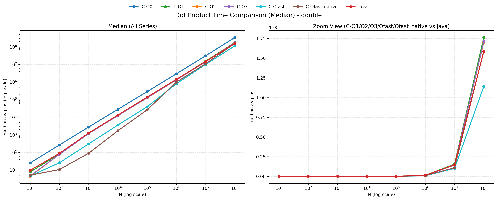 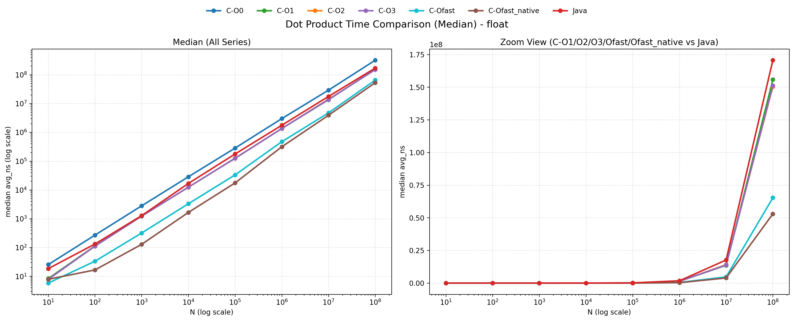 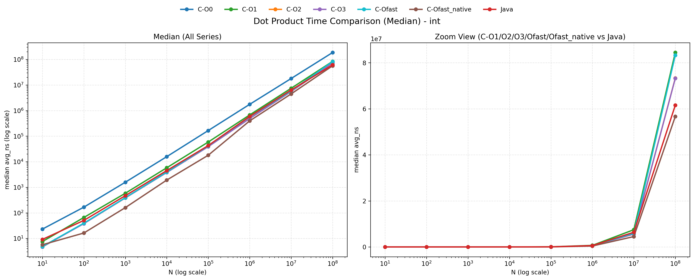 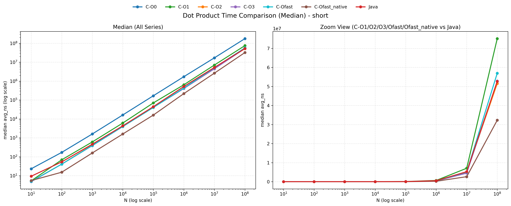 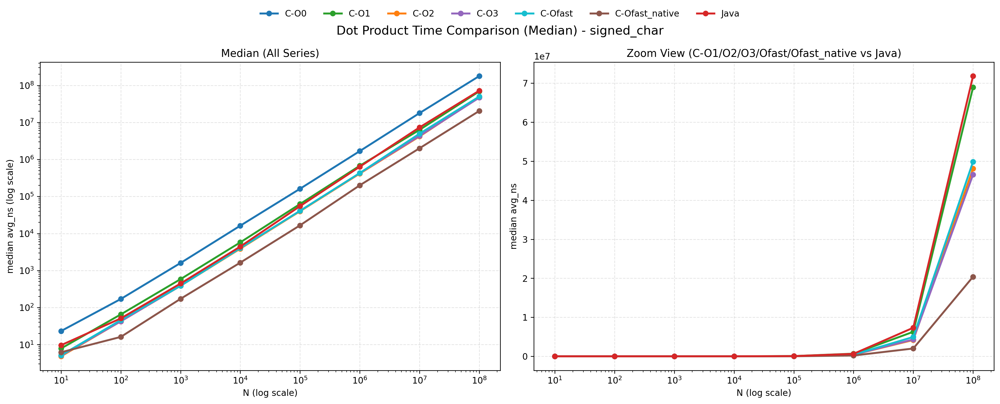
在 C 和 Java 中，对于每种数据类型，随着 N 从 10 增加到 100,000,000，运行时间基本呈线性增长。这表明算法的时间复杂度确实是 O(N)，每增加一个元素，计算时间就增加一个固定的量。

---
## 8. 跨平台差异
实验并未就此告一段落。
为了验证本次基准测试的普适性，并排除单一硬件平台的偶然性，本实验额外引入了一台高性能 Windows 节点进行了交叉比对。
### Median

| type        |         N |     C-O0 |     C-O1 |     C-O2 |     C-O3 |   C-Ofast |     Java |
|:------------|----------:|---------:|---------:|---------:|---------:|----------:|---------:|
| short       |        10 | 1.450000 | 0.328000 | 0.237000 | 0.236000 |  0.214000 | 0.604000 |
| short       |       100 | 1.689500 | 0.343500 | 0.136900 | 0.134500 |  0.131200 | 0.237100 |
| short       |      1000 | 1.613840 | 0.254740 | 0.133990 | 0.132330 |  0.137960 | 0.225030 |
| short       |     10000 | 1.586110 | 0.234015 | 0.130230 | 0.133550 |  0.131820 | 0.214435 |
| short       |    100000 | 1.618165 | 0.214695 | 0.133035 | 0.136425 |  0.135200 | 0.213480 |
| short       |   1000000 | 1.608845 | 0.225990 | 0.161395 | 0.139995 |  0.155745 | 0.232915 |
| short       |  10000000 | 1.587875 | 0.257960 | 0.194685 | 0.192140 |  0.191630 | 0.278580 |
| short       | 100000000 | 1.525574 | 0.258110 | 0.188924 | 0.191731 |  0.188819 | 0.270314 |
| int         |        10 | 1.442000 | 0.330000 | 0.280000 | 0.306000 |  0.309000 | 0.589000 |
| int         |       100 | 1.616900 | 0.302700 | 0.295900 | 0.296600 |  0.301400 | 0.112600 |
| int         |      1000 | 1.551230 | 0.234660 | 0.261900 | 0.258120 |  0.246520 | 0.108120 |
| int         |     10000 | 1.616310 | 0.223410 | 0.224215 | 0.229295 |  0.221975 | 0.104550 |
| int         |    100000 | 1.616740 | 0.222315 | 0.216970 | 0.220560 |  0.221135 | 0.105615 |
| int         |   1000000 | 1.544245 | 0.244305 | 0.245715 | 0.244325 |  0.240890 | 0.131170 |
| int         |  10000000 | 1.526535 | 0.375020 | 0.392520 | 0.387505 |  0.380040 | 0.294400 |
| int         | 100000000 | 1.540541 | 0.380628 | 0.373183 | 0.384576 |  0.373662 | 0.289596 |
| float       |        10 | 1.436000 | 0.368000 | 0.378000 | 0.382000 |  0.322000 | 0.802000 |
| float       |       100 | 1.662100 | 0.376000 | 0.433400 | 0.432700 |  0.327400 | 0.315100 |
| float       |      1000 | 1.705920 | 0.422960 | 0.432650 | 0.437750 |  0.325600 | 0.402450 |
| float       |     10000 | 1.720835 | 0.433315 | 0.433085 | 0.433285 |  0.325950 | 0.411140 |
| float       |    100000 | 1.717560 | 0.438815 | 0.429130 | 0.434630 |  0.325130 | 0.418535 |
| float       |   1000000 | 1.742135 | 0.449040 | 0.444505 | 0.449960 |  0.345530 | 0.426575 |
| float       |  10000000 | 1.737165 | 0.491325 | 0.507195 | 0.514230 |  0.417220 | 0.479750 |
| float       | 100000000 | 1.704755 | 0.477978 | 0.486684 | 0.495384 |  0.411237 | 0.471956 |
| double      |        10 | 1.410000 | 0.237000 | 0.236000 | 0.237000 |  0.193000 | 0.592000 |
| double      |       100 | 1.626700 | 0.264800 | 0.266200 | 0.288700 |  0.125100 | 0.243100 |
| double      |      1000 | 1.705710 | 0.400130 | 0.401620 | 0.401800 |  0.196190 | 0.387780 |
| double      |     10000 | 1.714890 | 0.425850 | 0.425085 | 0.426950 |  0.214055 | 0.427440 |
| double      |    100000 | 1.734385 | 0.444045 | 0.453400 | 0.448560 |  0.263520 | 0.418000 |
| double      |   1000000 | 1.741865 | 0.487290 | 0.494605 | 0.490685 |  0.358615 | 0.459705 |
| double      |  10000000 | 1.722700 | 0.661475 | 0.647430 | 0.648965 |  0.561395 | 0.627105 |
| double      | 100000000 | 1.725696 | 0.623958 | 0.609947 | 0.608697 |  0.549368 | 0.613099 |
| signed_char |        10 | 1.471000 | 0.315000 | 0.310000 | 0.306000 |  0.305000 | 0.565000 |
| signed_char |       100 | 1.648500 | 0.295200 | 0.172200 | 0.175100 |  0.173000 | 0.247300 |
| signed_char |      1000 | 1.582770 | 0.232200 | 0.170630 | 0.174270 |  0.171280 | 0.219470 |
| signed_char |     10000 | 1.566480 | 0.226930 | 0.172100 | 0.177975 |  0.172150 | 0.234795 |
| signed_char |    100000 | 1.523180 | 0.216760 | 0.172420 | 0.173495 |  0.174420 | 0.215640 |
| signed_char |   1000000 | 1.449590 | 0.218780 | 0.180270 | 0.184250 |  0.184875 | 0.215670 |
| signed_char |  10000000 | 1.370585 | 0.224960 | 0.182510 | 0.180640 |  0.181160 | 0.232525 |
| signed_char | 100000000 | 1.433376 | 0.224853 | 0.178332 | 0.180164 |  0.181253 | 0.232870 |

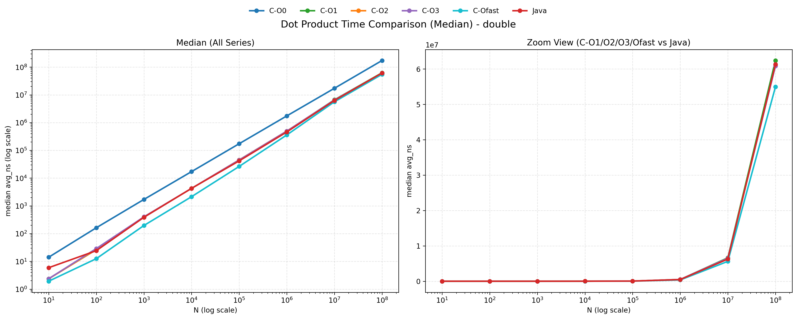 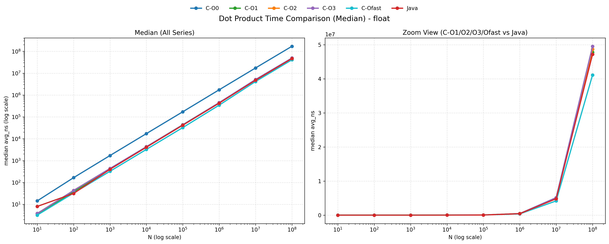 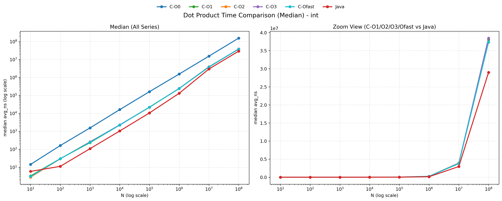 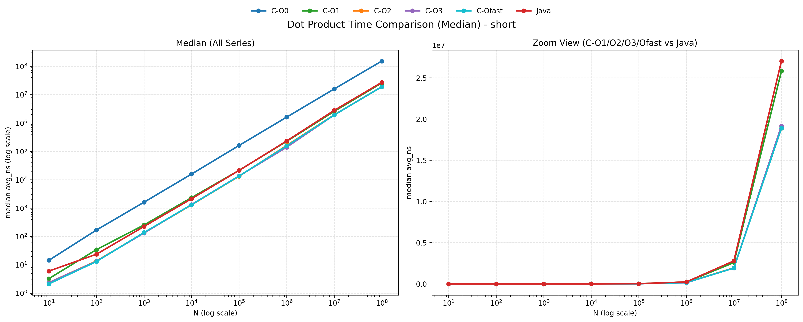 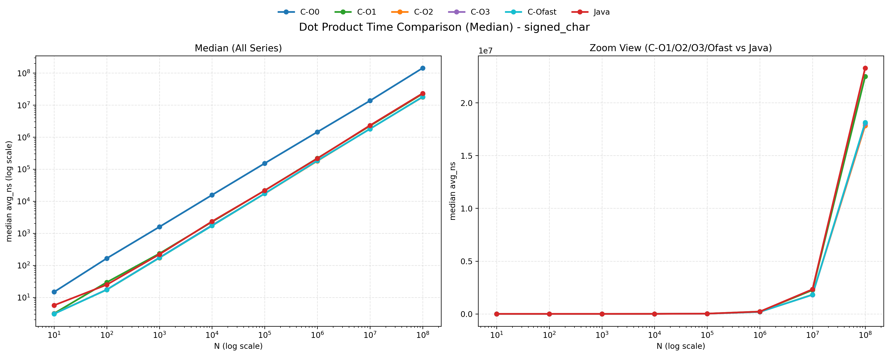

为了更明显地对比，我又绘制了如下图：
### Windows / macOS 性能比（Median）

- 比值定义：`Windows / macOS`。
- 小于 1 表示 Windows 更快；大于 1 表示 macOS 更快。

| type        |         N |   C-Ofast |   Java |
|:------------|----------:|----------:|-------:|
| short       |        10 |    0.4306 | 0.6474 |
| short       |       100 |    0.3234 | 0.4420 |
| short       |      1000 |    0.3484 | 0.4900 |
| short       |     10000 |    0.3327 | 0.4985 |
| short       |    100000 |    0.3380 | 0.4811 |
| short       |   1000000 |    0.3612 | 0.4488 |
| short       |  10000000 |    0.3751 | 0.5298 |
| short       | 100000000 |    0.3315 | 0.5134 |
| int         |        10 |    0.6411 | 0.6444 |
| int         |       100 |    0.7627 | 0.2224 |
| int         |      1000 |    0.6264 | 0.2301 |
| int         |     10000 |    0.5591 | 0.2319 |
| int         |    100000 |    0.5270 | 0.2461 |
| int         |   1000000 |    0.4151 | 0.2217 |
| int         |  10000000 |    0.6388 | 0.4612 |
| int         | 100000000 |    0.4486 | 0.4704 |
| float       |        10 |    0.5542 | 0.4356 |
| float       |       100 |    0.9832 | 0.2383 |
| float       |      1000 |    1.0204 | 0.3144 |
| float       |     10000 |    0.9844 | 0.2450 |
| float       |    100000 |    0.9771 | 0.2363 |
| float       |   1000000 |    0.7307 | 0.2415 |
| float       |  10000000 |    0.8769 | 0.2714 |
| float       | 100000000 |    0.6296 | 0.2766 |
| double      |        10 |    0.4187 | 0.6167 |
| double      |       100 |    0.4821 | 0.2727 |
| double      |      1000 |    0.6382 | 0.3051 |
| double      |     10000 |    0.5907 | 0.3208 |
| double      |    100000 |    0.6669 | 0.3000 |
| double      |   1000000 |    0.4437 | 0.3218 |
| double      |  10000000 |    0.5577 | 0.4272 |
| double      | 100000000 |    0.4820 | 0.3874 |
| signed_char |        10 |    0.5922 | 0.5861 |
| signed_char |       100 |    0.3774 | 0.4843 |
| signed_char |      1000 |    0.4430 | 0.4925 |
| signed_char |     10000 |    0.4278 | 0.5294 |
| signed_char |    100000 |    0.4267 | 0.3940 |
| signed_char |   1000000 |    0.4308 | 0.3393 |
| signed_char |  10000000 |    0.3656 | 0.3176 |
| signed_char | 100000000 |    0.3635 | 0.3243 |

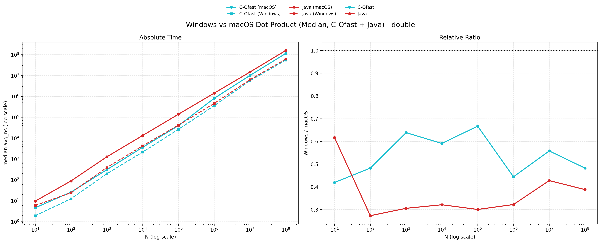 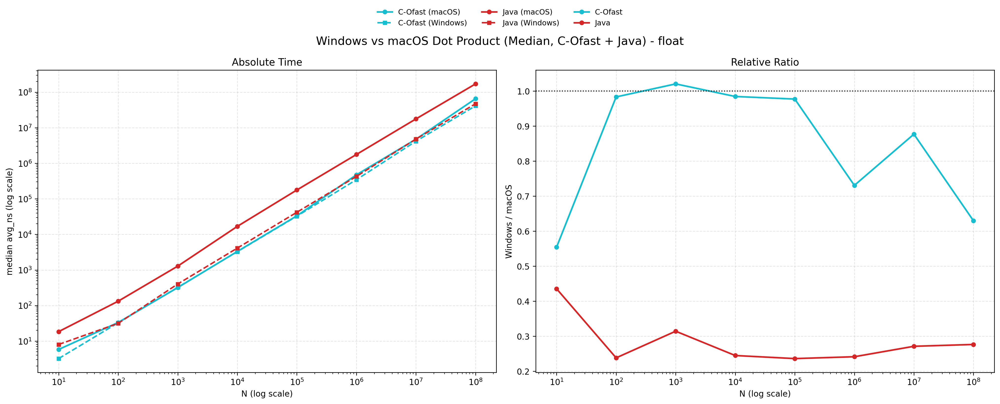 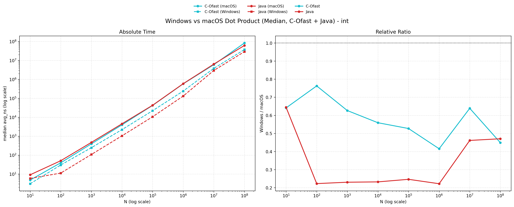 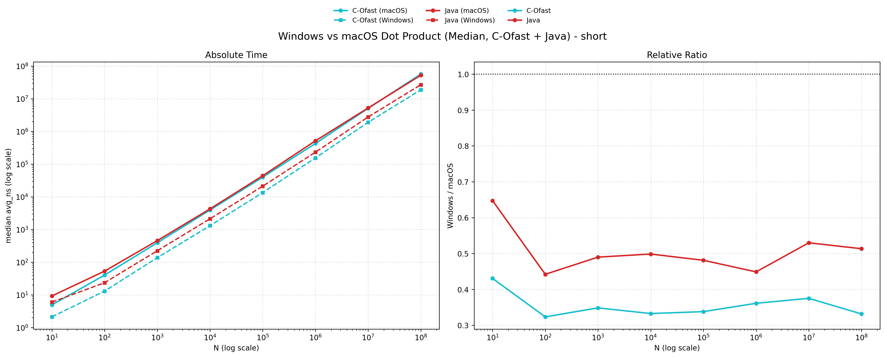 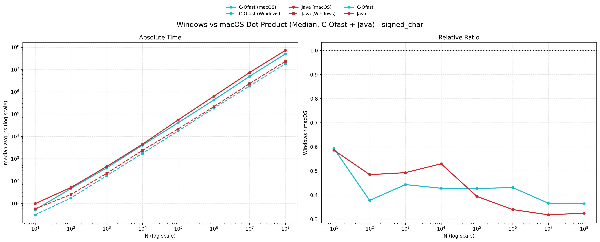


值得说明的是，在此次对比中观察到的“Windows 平台全面提速”现象，**其本质并非操作系统调度策略的优劣，而是两套测试环境在“底层硅片微架构”与“软件工具链”上存在着巨大的代际鸿沟。** 结合环境参数，我从以下三个维度进行分析：

### 8.1 核心算力与功耗墙的代际碾压
*   **硬件代差**：macOS 节点搭载的 i5-1038NG7（10 代 Ice Lake）属于 28W 低压轻薄本处理器；而 Windows 节点搭载的 i7-13650HX（13 代 Raptor Lake）则是 55W+ 功耗级别的发烧级移动工作站处理器。
*   **微架构表现**：后者不仅跨越了三代微架构的迭代，拥有极其显著的 **IPC（每时钟周期指令执行数）** 优势，且得益于极高的单核睿频（可达 4.9 GHz）和宽裕的散热上限，在执行数百万次循环的点乘基准测试时，完全不会像 i5 那样轻易触碰“温度墙（Thermal Throttling）”而降频。这种单核算力的绝对压制，使得即使在同等 `-O0` 或无向量化的代码下，Windows 节点的绝对耗时也大幅缩短。

### 8.2 L3 高速缓存的扩容与“内存墙”的推迟
这是导致两台机器在处理海量数据时表现迥异的最核心物理因素。
*   **缓存容量断层**：i5-1038NG7 的 L3 缓存仅有 **6 MB**，而 i7-13650HX 的 L3 缓存高达 **24 MB**。
*   **物理影响**：在向量长度 $N$ 达到千万级别时（如 $N = 10^7$），数组在内存中的物理占用急剧膨胀。拥有 24 MB 巨量 L3 缓存的 i7 能够将更大规模的数组分块完全容纳在距离 CPU 运算单元最近的片上缓存中，极大地降低了去主存（RAM）抓取数据的频率。反映在性能折线图上，**这使得 Windows 平台触碰“内存墙（Memory Bound）”的性能拐点显著向右（即向更大的 $N$ 值方向）推移**，展现出了更强大的数据流送吞吐力。

### 8.3 编译器与 JVM 的激进演进
软件层的优化同样带来了不可忽视的性能红利：
*   **C 语言编译器差异**：Windows 平台使用了极度新锐的 **GCC 15.1.0**，而 macOS 使用的是基于 LLVM 的 **Apple Clang 14**。对于深层嵌套的循环，GCC 15 在指令调度（Instruction Scheduling）和启发式循环展开（Heuristic Loop Unrolling）上往往更为激进，能更高效地压榨新 CPU 内部更宽的指令发射端。
*   **Java 虚拟机的跃升**：macOS 的 JDK 17 与 Windows 的 **JDK 24** 之间跨越了长达 7 年的版本演进。JDK 24 搭载的最新版 HotSpot 虚拟机在 **C2 即时编译器（JIT）** 上进行了大量优化，尤其是增强了对数组边界检查的消除能力以及对现代 CPU 的自动向量化（Auto-vectorization）支持，这进一步缩小了 Java 与底层 C 语言之间的绝对性能差距。

跨环境的对比数据有力地证明了：**极致的软件性能并非仅仅取决于编程语言的语法选择，而是“硬件微架构（缓存/频率/IPC）”与“编译器/虚拟机工具链深度”协同作用的最终产物。**

---
## 9. 实验结果
回到本次实验的核心问题：计算向量点乘，C 和 Java 究竟谁更快？
基于详实的基准测试数据，结论绝非简单的“非黑即白”，而是呈现出高度的场景依赖性。综合对比，我们得出以下四个核心维度的结论：
### 9.1 对于浮点数和short,signed char类型,C 语言占据统治地位
当我们追求极致的底层算力时，在浮点数和short,signed char类型下，C 语言毫无争议地赢得了比赛，但前提是必须正确配置编译器优化。在放宽精度限制的 -Ofast 级别下，C 语言彻底释放了 CPU 的 SIMD 向量化能力，float 与 short 的单步计算被极度压缩至惊人的 ~0.33 ns 与 ~0.40 ns。相比之下，Java 由于 JVM 需要兼顾跨平台一致性、严格遵守 IEEE 754 规范且具备数组边界检查机制，无法实施如此激进的底层指令重排。因此，在绝对的峰值算力对决中，完全优化的 C 语言展现出了对 Java 约 3 到 4 倍的显著速度优势。

### 9.2 对于int类型，java反超c
在整型（`int`）数组的点乘测试中，本实验观察到了一个极具反常识的现象：无论是在 macOS 还是 Windows 平台上，**Java 的执行速度均实质性地超越了开启激进优化 (`-Ofast` / `-O3`) 的 C 语言**（例如在 Windows 平台 $N=10^5$ 时，Java 领先 C 语言近 20%）。 
深入底层计算机体系结构分析，此现象并非打破了语言层面的常理，而是揭示了 **JIT（即时编译）与 AOT（提前编译）在指令集调度上的代差**。
C 语言（GCC/Clang）采用 AOT 编译，为了保证分发可执行文件的跨硬件兼容性，默认仅向后兼容生成基础指令集（如 128 位的 SSE2）。这意味着即便开启了 SIMD 向量化，C 语言单次也只能并行处理 4 个 32 位整型。
相反，Java 依赖 JVM 在运行时进行 JIT 编译，能够实时探测当前宿主机的物理 CPU 特性。面对测试平台先进的硬件（支持 256 位 AVX2 甚至 512 位指令集），JVM 动态生成了充分利用硬件位宽的顶级机器码，一次性处理 8 个或更多整型数据。**正是这种“硬件特征感知（Hardware-aware）”的动态编译能力，使得 Java 在默认状态下实现了对静态保守编译的 C 语言的算力反超。**

### 9.3 “开箱即用”与常规安全优化：Java 的表现令人惊叹
如果打破“C语言天生就快”的刻板印象，数据向我们揭示了现代 Java 的恐怖实力。
Java 完爆未优化的 C：Java 的执行速度（平均耗时 ~0.45 ns 到 ~1.5 ns）极其轻松地碾压了无优化的 C-O0（平均耗时 ~1.6 ns 到 ~3.5 ns）。
Java 逼近标准优化的 C：在标准优化（C-O2/C-O3，未开启破坏性数学优化）的严格安全计算环境下，Java 与 C 的差距被极大缩小。例如，当 N=10^4时，Java 的 double 耗时为 1.33 ns，而 C-O3 为 1.24 ns，两者几乎处于同一水平线。这得益于 JVM 内部强大的 C2 JIT（即时编译器）在运行时进行的动态循环展开和热点代码编译。
### 9.4 跨越“内存墙”后的"众生平等"
当数据规模达到海量级（N=10^8），导致 CPU 高速缓存（L3 Cache）彻底失效时，语言层面的性能差异开始消弭。
此时，计算的瓶颈从“CPU 算力”转移到了“内存带宽”。观察数据可知，无论是 C (-Ofast int = 0.83 ns) 还是 Java (int = 0.61 ns)，性能均出现了大幅衰减，且 Java 在处理超大整型数组时的内存流送效率甚至微妙地反超了激进优化的 C 语言。这意味着在受限于物理内存总线带宽的场景下，纠结 C 和 Java 的算力差异已失去实际意义。
### 9.5 总结
综上所述，关于“谁更快”的最终答案是：
如果开发对耗时极其敏感、且能精确控制底层硬件架构的高性能计算库（如游戏引擎物理计算、AI 张量计算），C 语言配合激进的编译器优化（-O3 / -Ofast）拥有无法逾越的速度优势。
但如果处于常规的企业级应用开发中，Java 凭借其卓越的 JIT 预热机制，能在不书写任何底层指令、不配置复杂编译参数的情况下，直接提供等同于 C 语言 -O2 级别的优异性能，并在复杂工程中展现出更高的安全性和开发效率。

---
## 10. check_sum 的正确性验证
为了探究`-O3,-Ofast,-Ofast -march=native` 开启SIMD向量化后，是否会对计算结果的正确性产生影响，我们在每次测试后都对 `check_sum` 进行了验证。 
在所有测试环境和数据规模下，`check_sum` 的结果均一致，这表明SIMD 向量化的引入并未破坏计算的正确性，编译器在优化过程中成功地保持了数值结果的一致性。这也验证了现代编译器在进行激进优化时，能够正确地分析和重排指令，同时确保遵守 IEEE 754 标准的数值精度要求。
结果放在附录中，可留给读者验证。

---
## 11. 终极释放-硬件原生指令集与 Vector API 的对决
在本次实验中，我们已经通过编译器优化选项（如 -Ofast）释放了 C 语言的 SIMD 向量化潜力，极大地提升了性能。然而，这种基于编译器自动向量化的优化仍然受限于编译器的分析能力和指令调度策略。
如果我们想要进一步挖掘现代 CPU 的算力潜力，直接使用**硬件原生指令集（如 AVX2/AVX-512）**进行手动向量化，或者在 Java 中利用**Vector API**进行显式的 SIMD 编程，将是下一步的极致优化路径。
通过手写 AVX2/AVX-512 指令，我们可以完全控制数据的加载、计算和存储过程，最大程度地减少指令调度的冗余和内存访问的开销，从而实现比编译器自动向量化更高的性能。
同样地，Java 的 Vector API 允许开发者以更高层次的抽象来编写 SIMD 代码，同时在运行时由 JVM 动态选择最适合当前硬件的指令集进行执行，这不仅能进一步提升性能，还能保持代码的可移植性。
因此，在追求极致性能的场景下，深入研究和应用硬件原生指令集以及 Java 的 Vector API，将是释放现代 CPU 全面算力的关键所在。

---

## 12.附录
### 12.1 check_sum 验证结果(从左至右分别是`-O3,-Ofast,-Ofast -march=native`)
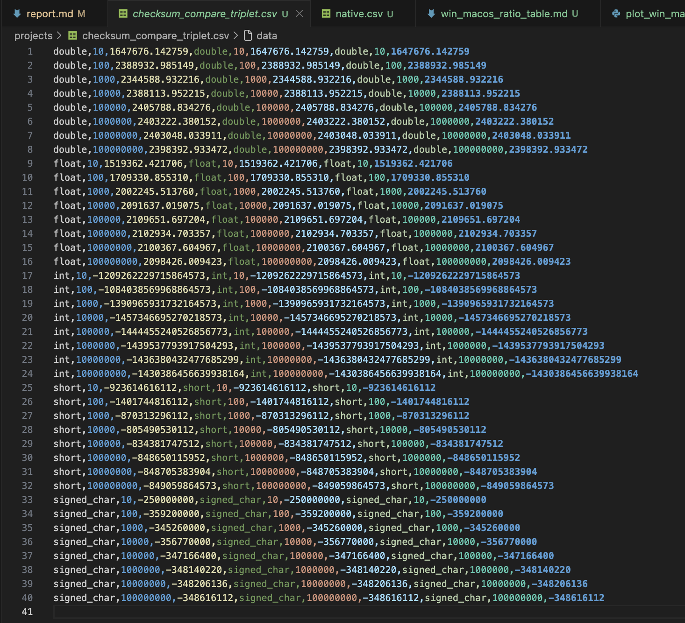

